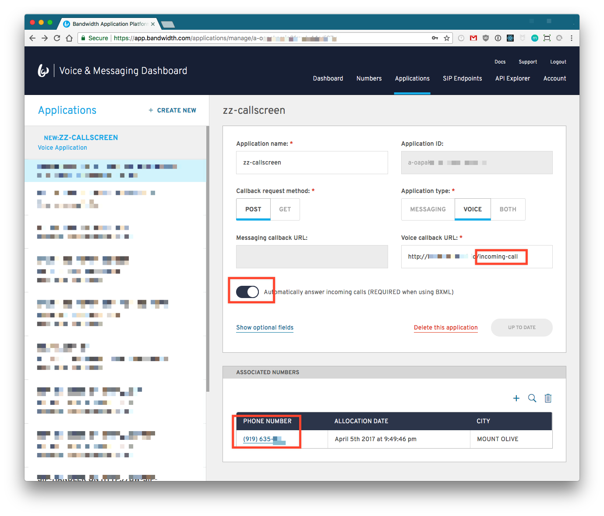

# Bandwidth Call Screen

## Assumptions
* You have signed up for the [Bandwidth voice & messaging APIs](https://app.bandwidth.com)
* You are familiar with how to:
  * [Receiving incoming calls](http://dev.bandwidth.com/howto/incomingCallandMessaging.html)

## Setup

This application requires:

* An [application](http://dev.bandwidth.com/ap-docs/methods/applications/applications.html) setup with:
  * `autoAnswer: true`
  * `incomingCallUrl: {{your-server}}/incoming-call`
* A phone number ordered and assigned to the `application`
* That your server is able to receive HTTP callbacks
* At least NodeJS v8.* +

### Application Setup




### Environment Variables

This specific app will forward **ALL** calls to a single phone number.  This is mainly to demonstrate the API calls used when building out the feature. As such it is required to specifiy a 'forward-to-number' as an environment variable.

| Variable Name          | Description                                                | Example                |
|:-----------------------|:-----------------------------------------------------------|:-----------------------|
| `BANDWIDTH_USER_ID`    | Your [`userid`](http://dev.bandwidth.com/security.html)    | `u-abc123`             |
| `BANDWIDTH_API_TOKEN`  | Your [`apiToken`](http://dev.bandwidth.com/security.html)  | `t-abc123`             |
| `BANDWIDTH_API_SECRET` | Your [`apiSecret`](http://dev.bandwidth.com/security.html) | `asdklf356890asdgnm35` |
| `FORWARD_TO_NUMBER`    | The number to forward **ALL** incoming calls               | `+18281231234`         |

### Running the app

After cloning the app and ensuring that your server is setup to receive callbacks.  Make sure that all the environment variables have been set.

```bash
node index.js
```

Then call any of the numbers you assigned to your application and see the screen!

### Room for improvement

* Allow transferred callee to send to voicemail
* Better package the audio file so that it doesn't just speak the name recorded
  * "You have a call from {{caller-name}} press 1 to accept or 2 to send to voicemail"
* Multiple forward-to numbers (would require data-store)

